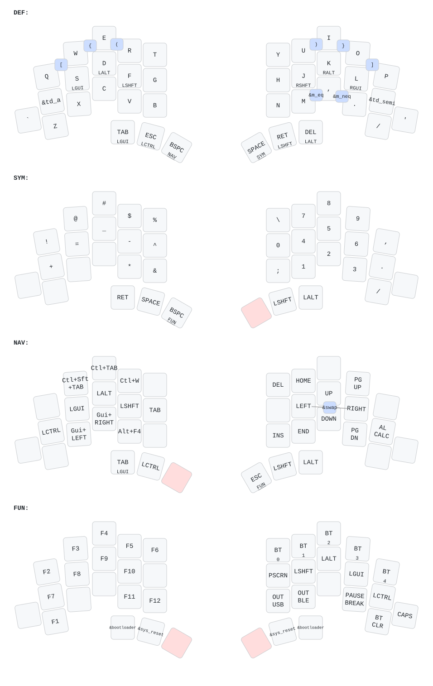

<picture>
  <source media="(prefers-color-scheme: dark)" srcset="/docs/images/TOTEM_logo_dark.svg">
  <source media="(prefers-color-scheme: light)" srcset="/docs/images/TOTEM_logo_bright.svg">
  
</picture>

# ZMK CONFIG FOR THE TOTEM SPLIT KEYBOARD

[Here](https://github.com/GEIGEIGEIST/totem) you can find the hardware files and build guide.\
[Here](https://github.com/GEIGEIGEIST/qmk-config-totem) you can find the QMK config for the TOTEM.

TOTEM is a 38 key column-staggered split keyboard running [ZMK](https://zmk.dev/) or [QMK](https://docs.qmk.fm/). It's meant to be used with a SEEED XIAO BLE or RP2040.

## Description

- Ultra-thin, ergonomic low profile split design requiring no wrist rest
- 38-keys split with column-staggered, splayed layout
- FDM-printed matte PLA cases and keycaps
- Dual-mode connectivity with USB Type-C wired and Bluetooth wireless
- Wireless connection between keyboard halves
- Seeed Studio XIAO nrf52840 (XIAO BLE)
- Hot-swappable Kailh Choc v1 low-profile switches
- Impressive battery life with 180mAh per half
- Customizable ZMK firmware, with ZMK Studio enabled
- Manual and firmware by Keycoon (<https://suns-shave-80u.craft.me/NDKH6lhuW8BzBi>)
- Keyboard designed by Geist (<https://github.com/GEIGEIGEIST/TOTEM>)
- Keycaps designed by Kea Workshop (<https://github.com/klouderone/KEA-choc-keycaps>)

## Layout

Generated using <https://github.com/caksoylar/keymap-drawer>.

<!-- SVG is auto-generated by the Draw ZMK keymap workflow on every keymap change -->

